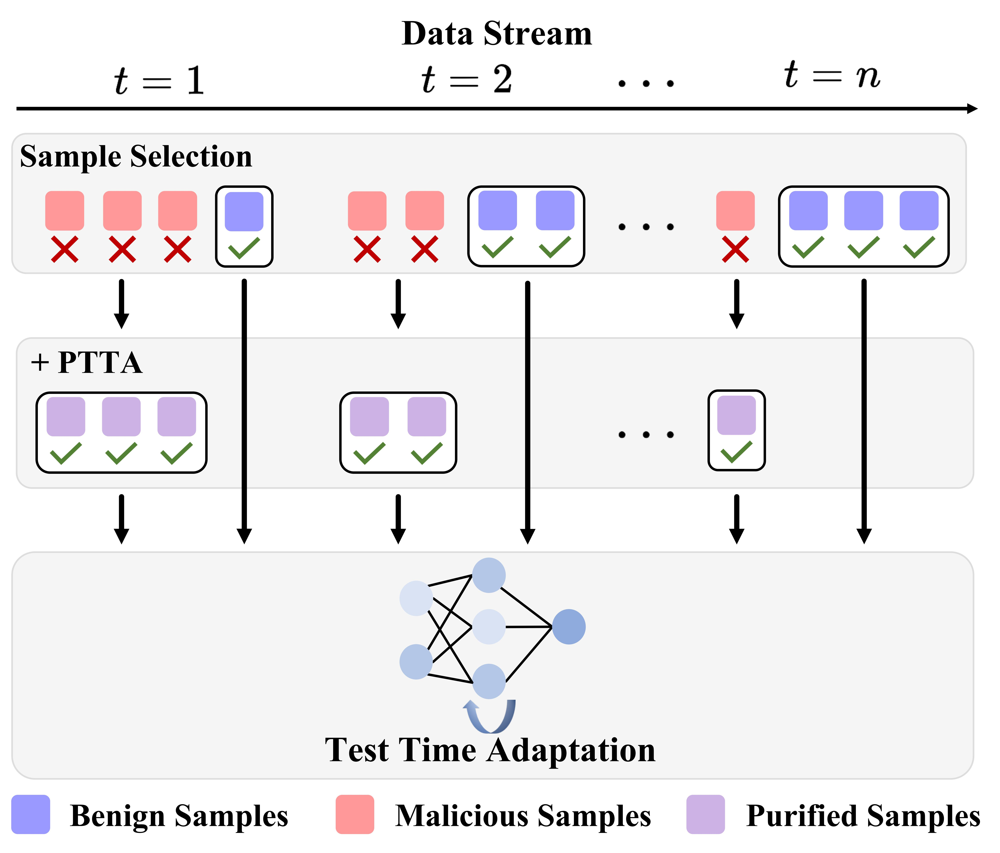

<article align="center" style="margin-bottom: 20px;">
    <h1 
        align="center"
        itemprop="title"
        style="font-size: 30px; font-weight: bold; margin-bottom: 20px;"
    >
    PTTA: <br/>Purifying Malicious Samples for Test-Time Model Adaptation
    </h1>
</article>

<div
    align="center"
    style="font-size: 18px; margin-bottom: 20px;"
>
    <a href="https://jimm0011.github.io/" target='_blank'>Jing Ma</a><sup>1</sup>&emsp;
    <a href="https://vain222.github.io/" target='_blank'>Hanlin Li</a><sup>1</sup>&emsp;
    <a href="https://eglxiang.github.io/" target='_blank'>Xiang Xiang</a><sup>1,2</sup>
</div>

<div 
    align="center"
    style="font-size: 16px; margin-bottom: 20px;"
>
<sup>1</sup>Huazhong University of Science and Technology (HUST)&emsp;

<sup>2</sup>Peng Cheng National Lab&emsp;
</div>


## Introduction

[]()
[]()

This repository contains the official implementation of [PTTA: Purifying Malicious Samples for Test-Time Model Adaptation]() published in [ICML 2025](https://icml.cc/Conferences/2025).
Please check the [paper]() for more details.

#### TL;DR (Too Long; Didn’t Read) :

> Rather than selecting and discarding malicious samples for test-time model adaptation, why not purify them into benign ones?


<details>
<summary>
    <b>Abstract :</b>
</summary>

<div style="display: flex; align-items: center;">
    <div style="flex: 1; padding: 1em;">
        Test-Time Adaptation (TTA) enables deep neural networks to adapt to arbitrary distributions during inference. Existing TTA algorithms generally tend to select benign samples that help achieve robust online prediction and stable self-training. Although malicious samples that would undermine the model's optimization should be filtered out, it also leads to a waste of test data. To alleviate this issue, we focus on how to make full use of the malicious test samples for TTA by transforming them into benign ones, and propose a plug-and-play method, PTTA. The core of our solution lies in the purification strategy, which retrieves benign samples having opposite effects on the objective function to perform Mixup with malicious samples, based on a saliency indicator for encoding benign and malicious data. This strategy results in effective utilization of the information in malicious samples and an improvement of the models' online test accuracy. In this way, we can directly apply the purification loss to existing TTA algorithms without the need to carefully adjust the sample selection threshold. Extensive experiments on four types of TTA tasks as well as classification, segmentation, and adversarial defense demonstrate the effectiveness of our method.
    </div>
    <div style="flex: 1;">
        
    </div>
</div>

</details>


<details>
<summary>
    <b>Lay Summary :</b>
</summary>

How can deep neural networks evolve through self-supervision without human intervention? This is a recent research trend, but difficult to solve well due to real-world complexity.

Our paper identifies the "malicious sample hazards" as an obstacle to model self-evolution. Prior solutions typically select and filter out malicious samples that negatively impact model optimization, which also reduces utilization of already limited data. Rather than discarding them, why not purify malicious samples into benign ones? Surprisingly, we found that superimpose benign samples—which exert the most opposite influence on the objective function—onto malicious samples effectively mitigates these hazards. 

Our findings reveal a new direction: using purification strategies to boost sample utilization during autonomous machine learning. This enables stable and efficient self-supervised evolution of deep neural networks.

</details>


<details>
<summary>
    <b>BibTeX :</b>
</summary>

```
@inproceedings{ma2025ptta,
  title={PTTA: Purifying Malicious Samples for Test-Time Model Adaptation},
  author={Ma, Jing and Li, Hanlin and Xiang, Xiang},
  booktitle={Forty-second International Conference on Machine Learning},
  year={2025},
}
```

</details>


## News

- **May 2025**:
🎉 Our paper (PTTA) has been accepted by [ICML 2025](https://icml.cc/).


## Installation
In our environment, the requirements are:
- Python == 3.9
- Pytorch == 1.9.0 (built with CUDA 11.1)
- torchvision == 0.10.0 (built with CUDA 11.1)
- timm == 0.4.12

We recommend using a virtual environment. Run:
```
pip install torch==1.9.0+cu111 torchvision==0.10.0+cu111 torchaudio==0.9.0 -f https://download.pytorch.org/whl/torch_stable.html
pip install timm==0.4.12
```

For additional details, refer to the installation guides of [EATA](https://github.com/mr-eggplant/EATA), [DeYO](https://github.com/Jhyun17/DeYO).

## Datasets
- ImageNet: You can download from [ImageNet](https://www.image-net.org/index.php)
- ImageNet-C: You can download from [ImageNet-C](https://zenodo.org/records/2235448#.YpCSLxNBxAc)
- ImageNet-A: You can download from [ImageNet-A](https://github.com/hendrycks/natural-adv-examples)
- ImageNet-R: You can download from [ImageNet-R](https://github.com/hendrycks/imagenet-r)
- ImageNet-V2: You can download from [ImageNet-V2](https://s3-us-west-2.amazonaws.com/imagenetv2public/imagenetv2-matched-frequency.tar.gz)
- ImageNet-Sketch: You can download from [ImageNet-Sketch](https://github.com/HaohanWang/ImageNet-Sketch)

You can put all datasets in a directory (e.g., /data/datasets/) and update paths in the commands accordingly.


## Usage

**Single (Continual) Test-Time Adaptation**
For CPL, use:
```
python main_cpl.py --data /data/datasets/ImageNet --data_corruption /data/datasets/ImageNet-C --exp_type ${exp_type} --algorithm ${algorithm} --batch_size 64 --level 5 --loss2_weight ${loss2_weight} --queue_size ${queue_size} --learning_rate 0.001 --neighbor ${neighbor} --network ${network}
```
- exp_type: `each_shift_reset` means Single Test-Time Adaptation, `continual` means Continual Test-Time Adaptation.
- algorithm: `cpl` means use CPL, `ptta_cpl` means use CPL with PTTA.
- loss2_weight: $\alpha$ in equation 8.
- queue_size: the size of Memory Bank.
- neighbor: the top-K samples.
- network: we use `resnet50` (ResNet-50) and `vit` (ViT-B/16).
- for Datasets like ImageNet-A etc., please replace the path in data_corruption.

For Tent ETA EATA DeYO, use:
```
python main.py --data /data/datasets/ImageNet --data_corruption /data/datasets/ImageNet-C --exp_type ${exp_type} --algorithm ${algorithm} --batch_size 64 --level 5 --loss2_weight ${loss2_weight} --queue_size ${queue_size} --learning_rate 0.001 --neighbor ${neighbor} --network ${network}
```
- algorithm: it can be `tent` `ptta_tent` `eta` `ptta_eta` `eata` `ptta_eata` `deyo` `ptta_deyo`.

**Lifelong Test-Time Adaptation**

CPL:
```
python main_lifelong_cpl.py --data /data/datasets/ImageNet/ --data_corruption /data/datasets/ImageNet-C --exp_type 'continual' --algorithm ptta_cpl --batch_size 64 --level 5 --loss2_weight 0.5 --queue_size 1000 --learning_rate 0.001 --neighbor 1 --network vit

```
ETA, EATA, DeYO:
```
python main_lifelong.py --data /data/datasets/ImageNet/ --data_corruption /data/datasets/ImageNet-C --exp_type 'continual' --algorithm ${algorithm} --batch_size 64 --level 5 --loss2_weight 3 --queue_size 1000 --learning_rate 0.001 --neighbor 1 --network vit
```
- algorithm: You can replace it with `ptta_eta` `ptta_eata` `ptta_deyo`.


## More Experiments

**For Pixel Feature Logit comparison**, replace --algorithm with `ptta_tent_pixel` `ptta_tent_feature` `ptta_eta_pixel` `ptta_eta_feature` `ptta_deyo_pixel` `ptta_deyo_feature`.

**For ID retrieval**:
```
python main_id.py --data /data/datasets/ImageNet/ --data_corruption /data/datasets/ImageNet-C --exp_type 'each_shift_reset' --algorithm ptta_eta --batch_size 64 --level 5 --loss2_weight 1 --queue_size 1000 --learning_rate 0.001 --neighbor 1 --seed 1 --network vit
```

```
python main_cpl_id.py --data /data/datasets/ImageNet/ --data_corruption /data/datasets/ImageNet-C --exp_type 'each_shift_reset' --algorithm ptta_cpl_id --batch_size 64 --level 5 --loss2_weight 1 --queue_size 1000 --learning_rate 0.001 --neighbor 1 --network vit
```

You can refer to the file  [example_shell.sh](example_shell.sh) for some examples.

## Citation

If you find our code useful or our work relevant, please consider citing:

```
@inproceedings{ma2025ptta,
  title={PTTA: Purifying Malicious Samples for Test-Time Model Adaptation},
  author={Ma, Jing and Li, Hanlin and Xiang, Xiang},
  booktitle={Forty-second International Conference on Machine Learning},
  year={2025},
}
```

## Acknowledgment

This code is inspired by the following repositories:

- [[Tent] Fully Test-Time Adaptation by Entropy Minimization](https://github.com/DequanWang/tent)

- [[EATA] Efficient Test-Time Model Adaptation without Forgetting](https://github.com/mr-eggplant/EATA)

- [[DeYO] Entropy is not Enough for Test-Time Adaptation: From the Perspective of Disentangled Factors](https://github.com/Jhyun17/DeYO)

- [[CPL] Candidate Pseudolabel Learning: Enhancing Vision-Language Models by Prompt Tuning with Unlabeled Data](https://github.com/vanillaer/CPL-ICML2024)
